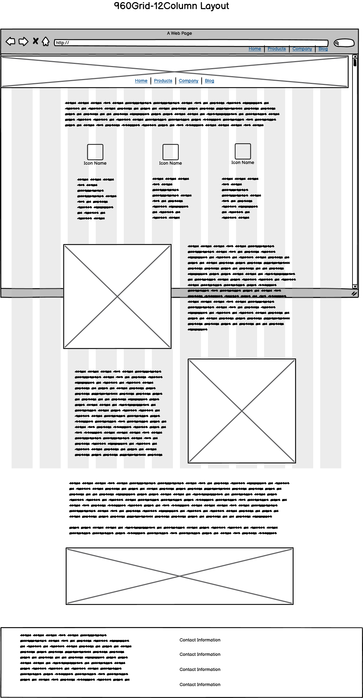
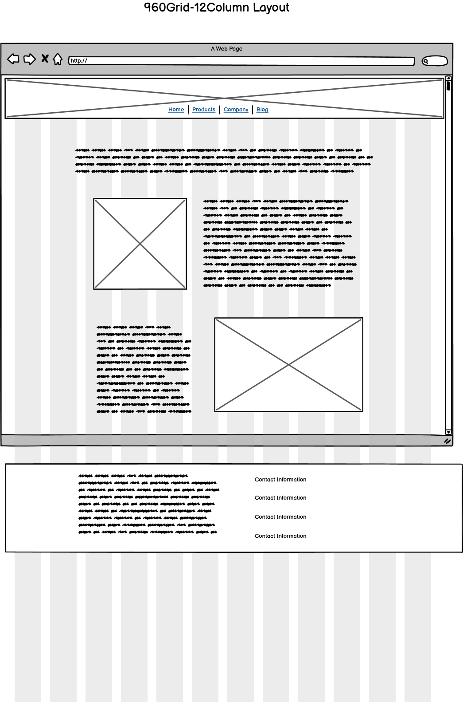

# Design Plan - dms.com - Diversified Manufacturing and Services

## Color Scheme

The site will complement the logo and images for the company which will consist of pc boards and industrial equipment by providing cool green tones and light and dark pastel-like brown colors. Some such colors are #effcef, #ccedd2, #94d3ac, #655c56, and #eeecda 

## Page Layout Wireframes

Provided below are the wireframe diagrams of the proposed application. They reflect what the site might look like on larger screen sizes but will have the flexibility to adapt to smaller screen sizes. The website is primarily composed of content detailing *DMS* and their provided services, most of the content will be text and images styled in a visually striking and professional manner. The contact/quote page will be the only page with text forms to contact the business, but all pages will display contact information. Furthermore, all pages will have a *DMS* logo heading the page along with navigation buttons.

### Home

### About Us

### Our Services

### Design Services

### Contact/Request a Quote

The site map reflects the static nature of the site. Most users will land on the home page which will have a general description of the company and direct the user towards traversing the rest of the site. 

## Site Map

