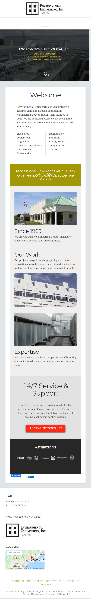
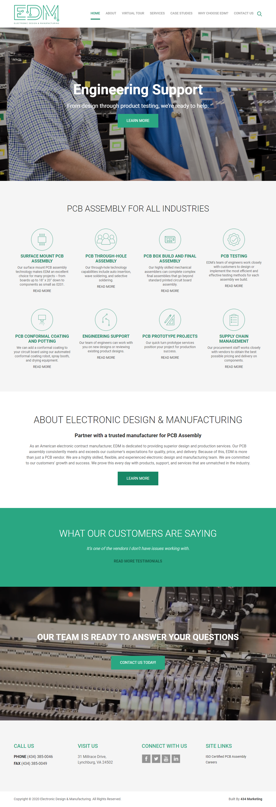
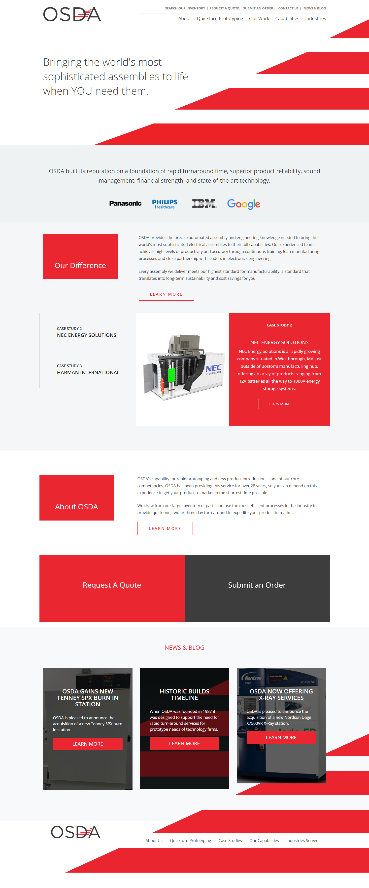

# Site Plan - dms.com

## Overview

*dms.com* is a website for the business 'Diversified Manufacturing and Services' (DMS). The goal of this site is to showcase the company, detail the company's products and services, and provide methods of contacting the business. The site will be a professional platform to increase the amount of requests to the business for their specific products and services.

This site will target prospective clients that are looking for an electronics manufacturer. Today it is expected that a legitimate business have a professional-looking website to inform the client and bridge their communication. Therefore, it is necessary that DMS provide an online presence to provide information about the business and facilitate client communication.

The site will be primarily static and built from scratch, custom to the professional environment DMS wishes to project. The content will span several pages and cover a general description of the company, specific manufacturing and design services, and methods of contacting and requesting quotes. The website will focus on responsive design and have a fluid, professional look on all platforms. The site will complement the logo and images for the company which will consist of pc boards and industrial equipment by providing cool green tones and light and dark pastel-like brown colors. Some such colors are #effcef, #ccedd2, #94d3ac, #655c56, and #eeecda 

## Goals

The primary goals of the site and corresponding objectives are given below.

### Generate Prospective Client Interest

* Increase business related inquiries via email, phone, or in-person. 
* Direct the user towards contacting DMS by maintaining visibility of that information.
* Maximize user *session duration* and *page views* using Google Analytics.

### Maximize larger orders

* Target clients specific to services and products provided by describing capabilites.
* Maximize requests for contracts by emphasizing capabilies of large-scale production.
* Increase the number of *page views* for pages describing specific products and services offered. 

## Target Users

There are two user categories that are expected to make up the bulk of traffic to *dms.com*.

### Kevin - Toothbrush Manufacturer Representative

Kevin is a representative from a company that makes toothbrushes and he is looking for a full-service electronics manufacturer to provide assembly, testing, and quality checking for an embedded device in a new brand of electronic toothbrush that his company is trying to develop.

Kevin's company has a design from his engineers and is looking for a local manufacturer that can handle both through-hole and surface-mount soldering in-house. It would be great if he could find a company that is capable of full-service assembly and lands on *dms.com*. 

Kevin works through the pages on a destop computer and easily finds that DMS provides all the services necessary to manufacturer the device and requests a quote on 400 units.

### Jennifer - Inventor and Entrepreneur 

Sarah is an entrepreneur with an idea for a new kid's toy but hasn't much experience with electronics design or the manufacturing process. She wants to find a business that is partnered with an electronics engineering company and can provide prototypes to test out her idea.

Sarah would also like to be able to expand her business if the idea for the kid's toy turns out well, so she is looking for a company that can handle manufacturing and scale with potential demand.

Sarah is often meeting with many of her own clients and usually visits websites on a smartphone. She lands on *dms.com* and is impressed with the fluid and professional mobile design of the website. She finds that DMS is partnered with an electronics engineering company and decides to give DMS a call.

## Content

### Home

The home page will be the entry point of the site for most users. This will consist of a logo and a general description of the company.

### About Us

This page will detail the company's origin, partnerships, goals, and the commitment to the customer.

### Services

This page will consist of two sections: manufacturing services and design services. Each section will detail the specifics of what the company is capable of.

### Request a Quote

Detailed explanation on how to request a quote and a provided form.

### Contact

Contact information will always be visible independent of the page. General contact information and a contact form will also be provided on this page.

## Similar Sites

### eei-hvac.com

* Environmental Engineering Inc. has an excellent responsive design that reflects the goals of this site in the way that content is offset on larger sreens and stacked on smaller screens. The navbar is simple and provides a logo which *dms.com* will have. It also has a map pinning their location on the home page.

### edmva.com

* EDMVA has an excellent landing page with modern-styled images describing their services and a striking video background near the contact section. The home page for *dms.com* will be similar to this, but on smaller devices, the page will be less cluttered. EDMVA does not scale the images describing their services on smaller screens, so it makes for a tedious section to scroll through, although the same section looks great on larger screens. 

### osda.com

* OSDA's website is also responsive but has a simple, uncluttered layout that more aggresively directs the user towards submitting an order. The site also looks great at all screen sizes, even extra large in which the red background logo has room to fill the margins. *dms.com* will have similar responsive navigation design in which on larger screens, there will be a top-fixed header, and on smaller screens a navigation menu will be toggled.

